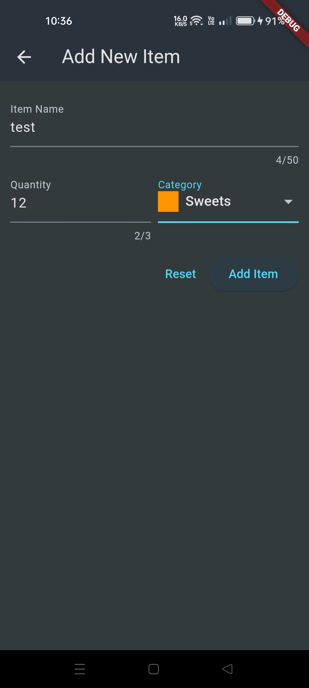
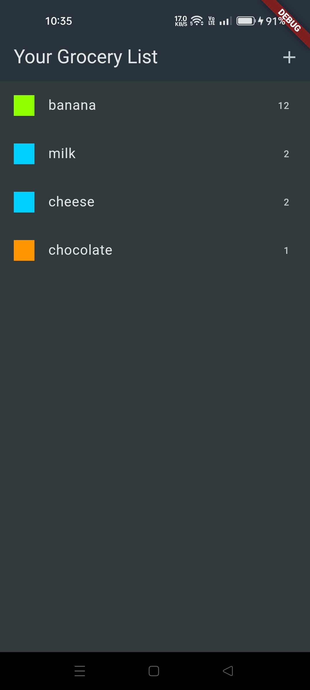

# Shopping List App

This is a shopping list app built with Flutter.

## Description

The Shopping List App allows users to create and manage their shopping lists. Users can add items to their list and delete items from the list.
All the items stored in the list are saved on a firebase database over the cloud

## Features
- Add items to the shopping list
- Delete items from the shopping list

## Screenshots

- When the list is empty

- Item Input Screen

- List Screen

## Installation

To run the Shopping List App on your local machine, follow these steps:

1. Clone the repository: `git clone https://github.com/KrishKoria/shopping_list_app.git`
2. Navigate to the project directory: `cd shopping_list_app`
3. Install dependencies: `flutter pub get`
4. Run the app: `flutter run`

## Contributing

Contributions are welcome! If you would like to contribute to the Shopping List App, please follow these guidelines:

1. Fork the repository
2. Create a new branch: `git checkout -b feature/your-feature-name`
3. Make your changes and commit them: `git commit -m 'Add your feature description'`
4. Push to the branch: `git push origin feature/your-feature-name`
5. Submit a pull request

